# UH-NU1: Object Diagram - Monthly Menu Management System

## Overview
This diagram represents the complete dashboard menu system including:
- **MenuFragment** (Monthly Menu Calendar) - Fully Implemented ✅
- **ShiftsFragment** (Shift History) - Stub/Placeholder 🚧
- **ShiftChangeFragment** (Shift Change Request) - Stub/Placeholder 🚧
- **VacationsFragment** (Vacation Request) - Partially Implemented ⚠️

---

## Architecture Layers

```mermaid
classDiagram
    %% ========================================
    %% MODEL LAYER (Data/Entities)
    %% ========================================

    class MenuDayInfo {
        <<GraphQL Type>>
        +ID! id
        +Date! date
        +String! breakfast
        +String! lunch
        +String! dinner
        +Boolean! isHoliday
    }

    class MonthlyMenuCalendar {
        <<GraphQL Type>>
        +Int! year
        +Int! month
        +MenuDayInfo[] days
    }

    class UploadMonthlyMenuInput {
        <<GraphQL Input>>
        +Int! year
        +Int! month
        +String! filename
        +String! fileBase64
    }

    class MenuChangeItemInput {
        <<GraphQL Input>>
        +ID! menuDayId
        +Date! day
        +String! mealType
        +String! newValue
        +String! reason
        +Boolean! emergency
    }

    class ProposeMenuChangeInput {
        <<GraphQL Input>>
        +MenuChangeItemInput[] items
    }

    class UploadMenuResponse {
        <<GraphQL Type>>
        +String! status
        +String! message
    }

    class MenuChangeInfo {
        <<GraphQL Type>>
        +ID! id
        +String! status
    }

    class MonthlyMenuQuery_Menu {
        <<Apollo Generated>>
        +Int year
        +Int month
        +List~Day~ days
    }

    class MonthlyMenuQuery_Day {
        <<Apollo Generated>>
        +String id
        +String date
        +String breakfast
        +String lunch
        +String dinner
        +Boolean isHoliday
    }

    class Result~T~ {
        <<Sealed Class>>
        +Success~T~(data: T)
        +Error(message: String, exception: Exception?)
        +Loading
    }

    class MenuDay {
        <<Inner Data Class>>
        +MutableList~String~ desayuno
        +MutableList~String~ almuerzo
        +MutableList~String~ cena
    }

    %% Model Relationships
    MonthlyMenuCalendar "1" --> "1..31" MenuDayInfo : contains
    ProposeMenuChangeInput "1" --> "1..*" MenuChangeItemInput : contains
    MonthlyMenuQuery_Menu "1" --> "0..31" MonthlyMenuQuery_Day : contains

    %% ========================================
    %% CONTROL LAYER (Business Logic)
    %% ========================================

    class MainActivity {
        <<Activity>>
        +ActivityMainBinding binding
        +onCreate()
        +setupNavigation()
    }

    class NavHostFragment {
        <<Android Component>>
        +NavController navController
    }

    class DashboardOption {
        <<Data Class>>
        +String key
        +Int titleRes
        +Int iconRes
    }

    class DashboardAdapter {
        <<RecyclerView Adapter>>
        +List~DashboardOption~ options
        +onClick: (DashboardOption) -> Unit
        +onBindViewHolder()
    }

    class DashboardFragment {
        <<Fragment>>
        +FragmentDashboardBinding binding
        +RecyclerView recyclerView
        +TokenManager tokenManager
        +onViewCreated()
        +setupOptions()
        +navigateToMenuFragment()
        +navigateToShiftsFragment()
        +navigateToShiftChangeFragment()
        +navigateToVacationsFragment()
    }

    class MenuFragment {
        <<Fragment>> ✅ COMPLETE
        +FragmentMenuBinding binding
        +MenuViewModel viewModel
        +Calendar calendar
        +Map~Int, String~ menuDayIdByDay
        +Map~Int, MenuDay~ menuData
        +onViewCreated()
        +queryBackend()
        +paintMenu()
        +updateCalendar()
        +addDayCell()
        +showMenuDialog()
        +toggleEditMeal()
        +proposeFor()
        +openFilePicker()
        +handleSelectedFile()
    }

    class MenuViewModel {
        <<AndroidViewModel>> ✅ COMPLETE
        +MenuRepository repository
        +LiveData~Menu~ menu
        +LiveData~Boolean~ loading
        +LiveData~String~ message
        +loadMenu(year: Int, month: Int)
        +uploadMenu(...)
        +proposeChanges(...)
    }

    class MenuRepository {
        <<Repository>> ✅ COMPLETE
        +ApolloClient apolloClient
        +Context context
        +getMonthlyMenu(year, month): Result~Menu~
        +uploadMonthlyMenu(...): Result~String~
        +proposeMenuChange(...): Result~Int~
    }

    class ApolloClientProvider {
        <<Singleton>>
        -volatile ApolloClient instance
        +getInstance(context): ApolloClient
        -buildApolloClient(): ApolloClient
    }

    class ShiftsFragment {
        <<Fragment>> 🚧 STUB
        +FragmentShiftsBinding binding
        +onViewCreated()
        Note: Shows "Pantalla en construcción"
    }

    class ShiftChangeFragment {
        <<Fragment>> 🚧 STUB
        +FragmentShiftChangeBinding binding
        +onViewCreated()
        Note: Shows "Pantalla en construcción"
    }

    class VacationsFragment {
        <<Fragment>> ⚠️ PARTIAL
        +FragmentVacationsBinding binding
        +MaterialDatePicker datePicker
        +onViewCreated()
        +setupDropdowns()
        +openDateRangePicker()
        +validateForm()
        +btnSolicitar.onClick()
        Note: UI only, no backend (TODO line 90)
    }

    %% Control Layer Relationships
    MainActivity "1" --> "1" NavHostFragment : hosts
    MainActivity "1" --> "1" DashboardFragment : contains

    DashboardFragment "1" --> "1" DashboardAdapter : uses
    DashboardAdapter "1" --> "3..4" DashboardOption : manages
    DashboardFragment "1" ..> "0..1" MenuFragment : navigates to (if NUTRITIONIST)
    DashboardFragment "1" ..> "0..1" ShiftsFragment : navigates to
    DashboardFragment "1" ..> "0..1" ShiftChangeFragment : navigates to
    DashboardFragment "1" ..> "0..1" VacationsFragment : navigates to

    MenuFragment "1" --> "1" MenuViewModel : observes
    MenuFragment "1" --> "1..*" MenuDay : stores in map
    MenuViewModel "1" --> "1" MenuRepository : calls
    MenuRepository "1" --> "1" ApolloClientProvider : uses
    MenuRepository ..> Result~T~ : returns

    %% ========================================
    %% VIEW LAYER (UI Components - XML Layouts)
    %% ========================================

    %% Dashboard Layouts
    class fragment_dashboard_xml {
        <<XML Layout>>
        +RecyclerView rvOptions
    }

    class item_dashboard_option_xml {
        <<XML Layout>>
        +MaterialCardView root
        +FrameLayout iconContainer
        +AppCompatImageView ivIcon
        +TextView tvTitle
    }

    %% Menu Layouts
    class fragment_menu_xml {
        <<XML Layout>> ✅
        +ConstraintLayout root
        +TextView tvBreadcrumb
        +LinearLayout layoutMonthNav
        +ImageButton btnPrevMonth
        +TextView tvCurrentMonth
        +ImageButton btnNextMonth
        +LinearLayout layoutFileSelector
        +MaterialButton btnSelectFile
        +TextView tvFileName
        +MaterialCardView cardCalendar
        +ScrollView scrollCalendar
        +GridLayout gridCalendar
    }

    class dialog_menu_day_xml {
        <<XML Layout>> ✅
        +MaterialCardView root
        +TextView btnClose
        +MaterialCardView cardDay
        +TextView tvDayNumber
        +TextView tvDayName
        +TextView tvDesayunoTitle
        +LinearLayout layoutDesayuno
        +MaterialButton btnCambiarDesayuno
        +TextView tvAlmuerzoTitle
        +LinearLayout layoutAlmuerzo
        +MaterialButton btnCambiarAlmuerzo
        +TextView tvCenaTitle
        +LinearLayout layoutCena
        +MaterialButton btnCambiarCena
    }

    %% Shifts Layouts
    class fragment_shifts_xml {
        <<XML Layout>> 🚧
        +ConstraintLayout root
        +TextView tvTitle
        +TextView tvPlaceholder
    }

    class fragment_shift_change_xml {
        <<XML Layout>> 🚧
        +ConstraintLayout root
        +TextView tvTitle
        +TextView tvPlaceholder
    }

    class item_shift_small_xml {
        <<XML Layout>> ❌ UNUSED
        +MaterialCardView root
        +LinearLayout datePill
        +TextView dayNumber
        +TextView dayName
        +LinearLayout col1
        +TextView tvEntrada
        +LinearLayout col2
        +TextView tvSalida
        +LinearLayout col3
        +TextView tvTotal
    }

    %% Vacations Layout
    class fragment_vacations_xml {
        <<XML Layout>> ⚠️
        +ConstraintLayout root
        +TextView tvTitle
        +TextView btnLogout
        +MaterialCardView cardForm
        +TextView tvBreadcrumb
        +TextInputLayout tilTipo
        +MaterialAutoCompleteTextView etTipo
        +TextInputLayout tilDias
        +MaterialAutoCompleteTextView etDias
        +TextInputLayout tilInicio
        +TextInputEditText etInicio
        +TextInputLayout tilFin
        +TextInputEditText etFin
        +TextInputLayout tilMotivo
        +TextInputEditText etMotivo
        +MaterialButton btnSolicitar
    }

    %% View Binding Classes (Generated)
    class FragmentMenuBinding {
        <<Generated View Binding>>
        +TextView tvBreadcrumb
        +LinearLayout layoutMonthNav
        +MaterialButton btnSelectFile
        +TextView tvFileName
        +GridLayout gridCalendar
        +bind(View)
        +inflate(LayoutInflater)
    }

    class FragmentDashboardBinding {
        <<Generated View Binding>>
        +RecyclerView rvOptions
        +bind(View)
        +inflate(LayoutInflater)
    }

    class FragmentShiftsBinding {
        <<Generated View Binding>>
        +TextView tvTitle
        +TextView tvPlaceholder
        +bind(View)
        +inflate(LayoutInflater)
    }

    class FragmentShiftChangeBinding {
        <<Generated View Binding>>
        +TextView tvTitle
        +TextView tvPlaceholder
        +bind(View)
        +inflate(LayoutInflater)
    }

    class FragmentVacationsBinding {
        <<Generated View Binding>>
        +TextView tvBreadcrumb
        +MaterialAutoCompleteTextView etTipo
        +MaterialAutoCompleteTextView etDias
        +TextInputEditText etInicio
        +TextInputEditText etFin
        +TextInputEditText etMotivo
        +MaterialButton btnSolicitar
        +bind(View)
        +inflate(LayoutInflater)
    }

    class ItemDashboardOptionBinding {
        <<Generated View Binding>>
        +AppCompatImageView ivIcon
        +TextView tvTitle
        +bind(View)
        +inflate(LayoutInflater)
    }

    class DayCell {
        <<Programmatically Created>>
        +LinearLayout root
        +TextView dayNumber
        +TextView[] mealItems
        +onClick: showDialog()
    }

    %% XML to View Binding Relationships
    fragment_dashboard_xml --|> FragmentDashboardBinding : generates
    fragment_menu_xml --|> FragmentMenuBinding : generates
    fragment_shifts_xml --|> FragmentShiftsBinding : generates
    fragment_shift_change_xml --|> FragmentShiftChangeBinding : generates
    fragment_vacations_xml --|> FragmentVacationsBinding : generates
    item_dashboard_option_xml --|> ItemDashboardOptionBinding : generates

    %% Fragment to Binding Relationships
    DashboardFragment "1" --> "1" FragmentDashboardBinding : inflates
    DashboardFragment "1" --> "1" fragment_dashboard_xml : uses layout
    MenuFragment "1" --> "1" FragmentMenuBinding : inflates
    MenuFragment "1" --> "1" fragment_menu_xml : uses layout
    MenuFragment "1" --> "0..1" dialog_menu_day_xml : shows as dialog
    ShiftsFragment "1" --> "1" FragmentShiftsBinding : inflates
    ShiftsFragment "1" --> "1" fragment_shifts_xml : uses layout
    ShiftChangeFragment "1" --> "1" FragmentShiftChangeBinding : inflates
    ShiftChangeFragment "1" --> "1" fragment_shift_change_xml : uses layout
    VacationsFragment "1" --> "1" FragmentVacationsBinding : inflates
    VacationsFragment "1" --> "1" fragment_vacations_xml : uses layout

    %% Adapter to Item Relationships
    DashboardAdapter "1" --> "3..4" ItemDashboardOptionBinding : inflates per item
    DashboardAdapter "1" --> "3..4" item_dashboard_option_xml : uses layout

    %% Dynamic View Creation
    fragment_menu_xml "1" --> "1" GridLayout : contains
    GridLayout "1" --> "0..31" DayCell : dynamically creates

    %% ========================================
    %% NAVIGATION & DATA FLOW
    %% ========================================

    class MobileNavigation {
        <<Navigation Graph>>
        +navigation_home
        +navigation_dashboard
        +navigation_notifications
        +menuFragment
        +shiftsFragment
        +shiftChangeFragment
        +vacationsFragment
    }

    NavHostFragment "1" --> "1" MobileNavigation : uses

    %% Apollo GraphQL Operations (not shown as classes to avoid clutter)
    note for MenuRepository "Executes:\n- MonthlyMenuQuery\n- UploadMonthlyMenuMutation\n- ConfirmOverwriteMonthlyMenuMutation\n- ProposeMenuChangeMutation"

    note for DashboardFragment "Role-based access:\n- 'menu_mes' only shown if role == NUTRITIONIST\n- Other options shown to all roles"

    note for VacationsFragment "TODO (line 90):\nBackend integration pending\nNo GraphQL operations defined"

    note for ShiftsFragment "Placeholder only\nNo backend, ViewModel, or Repository"

    note for ShiftChangeFragment "Placeholder only\nNo backend, ViewModel, or Repository"
```

---

## Cardinality Summary

### Dashboard System
| From | To | Cardinality | Description |
|------|-----|-------------|-------------|
| MainActivity | NavHostFragment | 1 → 1 | Single navigation host |
| MainActivity | DashboardFragment | 1 → 1 | Main dashboard container |
| DashboardFragment | DashboardAdapter | 1 → 1 | RecyclerView adapter |
| DashboardAdapter | DashboardOption | 1 → 3..4 | 3 base + 1 conditional (NUTRITIONIST) |
| DashboardFragment | MenuFragment | 1 → 0..1 | Conditional navigation |
| DashboardFragment | ShiftsFragment | 1 → 0..1 | Conditional navigation |
| DashboardFragment | ShiftChangeFragment | 1 → 0..1 | Conditional navigation |
| DashboardFragment | VacationsFragment | 1 → 0..1 | Conditional navigation |

### Menu Feature (Complete Implementation)
| From | To | Cardinality | Description |
|------|-----|-------------|-------------|
| MenuFragment | MenuViewModel | 1 → 1 | ViewModel per fragment instance |
| MenuViewModel | MenuRepository | 1 → 1 | Repository per ViewModel |
| MenuRepository | ApolloClientProvider | 1 → 1 | Singleton network client |
| MenuFragment | FragmentMenuBinding | 1 → 1 | View binding |
| MenuFragment | DialogMenuDay | 1 → 0..1 | On-demand dialog |
| MenuFragment | MenuDay | 1 → 1..31 | Stored in menuData map |
| GridLayout | DayCell | 1 → 0..31 | Dynamic day cells |

### Data Model
| From | To | Cardinality | Description |
|------|-----|-------------|-------------|
| MonthlyMenuCalendar | MenuDayInfo | 1 → 1..31 | Days in month |
| MenuDayInfo | Meals | 1 → 3 | breakfast, lunch, dinner |
| ProposeMenuChangeInput | MenuChangeItemInput | 1 → 1..* | One or more changes |
| MonthlyMenuQuery.Menu | MonthlyMenuQuery.Day | 1 → 0..31 | Days data |

### Stub Features
| Fragment | Binding | Cardinality | Notes |
|----------|---------|-------------|-------|
| ShiftsFragment | FragmentShiftsBinding | 1 → 1 | No other components |
| ShiftChangeFragment | FragmentShiftChangeBinding | 1 → 1 | No other components |
| VacationsFragment | FragmentVacationsBinding | 1 → 1 | No ViewModel/Repository |

---

## Implementation Status

### ✅ Fully Implemented
**MenuFragment - Monthly Menu Calendar**
- Complete MVVM architecture
- GraphQL schema and operations defined
- Repository with 3 operations (get, upload, propose changes)
- ViewModel with LiveData
- UI with calendar, file upload, inline editing
- Dialog for day details

**Components:**
- Model: MenuDayInfo, MonthlyMenuCalendar, Input/Response types
- Control: MenuFragment, MenuViewModel, MenuRepository
- View: fragment_menu.xml, dialog_menu_day.xml
- Navigation: Fully integrated from Dashboard

### ⚠️ Partially Implemented
**VacationsFragment - Vacation Request**
- UI and validation logic complete
- NO backend integration (TODO comment on line 90)
- NO GraphQL schema/operations
- NO Repository
- NO ViewModel

**Components:**
- Model: None
- Control: VacationsFragment (UI logic only)
- View: fragment_vacations.xml (complete form)
- Navigation: Integrated from Dashboard

### 🚧 Stub/Placeholder
**ShiftsFragment - Shift History**
- Shows "Pantalla en construcción" message
- NO business logic
- NO backend

**ShiftChangeFragment - Shift Change Request**
- Shows "Pantalla en construcción" message
- NO business logic
- NO backend

**Components:**
- Model: None
- Control: Fragment shell only
- View: Placeholder layouts
- Navigation: Integrated from Dashboard

### ❌ Unused
**item_shift_small.xml**
- Layout file exists but not referenced anywhere in code
- Potential future use for ShiftsFragment RecyclerView

---

## File Paths

### Model Layer
- **GraphQL Schema:** `app/src/main/graphql/schema.graphqls` (lines 132-182)
- **GraphQL Operations:** `app/src/main/graphql/operations.graphql` (lines 120-154)
- **Result Wrapper:** `app/src/main/java/com/sanna/provcalapp/data/models/Result.kt`
- **Apollo Generated:** `app/build/generated/source/apollo/service/com/sanna/provcalapp/`

### Control Layer
- **MainActivity:** `app/src/main/java/com/sanna/provcalapp/MainActivity.kt`
- **DashboardFragment:** `app/src/main/java/com/sanna/provcalapp/ui/dashboard/DashboardFragment.kt`
- **DashboardAdapter:** `app/src/main/java/com/sanna/provcalapp/ui/dashboard/DashboardAdapter.kt`
- **MenuFragment:** `app/src/main/java/com/sanna/provcalapp/ui/menu/MenuFragment.kt`
- **MenuViewModel:** `app/src/main/java/com/sanna/provcalapp/ui/menu/MenuViewModel.kt`
- **MenuRepository:** `app/src/main/java/com/sanna/provcalapp/data/repository/MenuRepository.kt`
- **ShiftsFragment:** `app/src/main/java/com/sanna/provcalapp/ui/menu/ShiftsFragment.kt`
- **ShiftChangeFragment:** `app/src/main/java/com/sanna/provcalapp/ui/menu/ShiftChangeFragment.kt`
- **VacationsFragment:** `app/src/main/java/com/sanna/provcalapp/ui/menu/VacationsFragment.kt`
- **ApolloClientProvider:** `app/src/main/java/com/sanna/provcalapp/data/remote/ApolloClientProvider.kt`

### View Layer
- **Navigation Graph:** `app/src/main/res/navigation/mobile_navigation.xml`
- **fragment_menu.xml:** `app/src/main/res/layout/fragment_menu.xml`
- **dialog_menu_day.xml:** `app/src/main/res/layout/dialog_menu_day.xml`
- **fragment_shifts.xml:** `app/src/main/res/layout/fragment_shifts.xml`
- **fragment_shift_change.xml:** `app/src/main/res/layout/fragment_shift_change.xml`
- **fragment_vacations.xml:** `app/src/main/res/layout/fragment_vacations.xml`
- **item_dashboard_option.xml:** `app/src/main/res/layout/item_dashboard_option.xml`
- **item_shift_small.xml:** `app/src/main/res/layout/item_shift_small.xml` (unused)

---

## Notes

1. **Role-Based Access:** The "menu_mes" (MenuFragment) option only appears for users with role "NUTRITIONIST" or "NUTRICIONISTA"

2. **Data Flow:**
   - Backend API → MenuRepository → MenuViewModel (LiveData) → MenuFragment → UI
   - User actions → MenuFragment → MenuViewModel → MenuRepository → Backend API

3. **File Upload:** MenuFragment supports multiple MIME types for menu file upload:
   - `application/vnd.ms-excel`
   - `application/vnd.openxmlformats-officedocument.spreadsheetml.sheet`
   - `text/csv`
   - `text/comma-separated-values`

4. **Conflict Handling:** Upload operation detects conflicts and shows dialog for user confirmation before overwriting existing menu

5. **Future Development:**
   - ShiftsFragment and ShiftChangeFragment need complete implementation
   - VacationsFragment needs backend integration (GraphQL operations, Repository, ViewModel)
   - item_shift_small.xml could be used for ShiftsFragment RecyclerView items

---

## Generated
**Date:** 2025-11-10
**Branch:** feature/integration-UH-NU1
**Tool:** Claude Code
